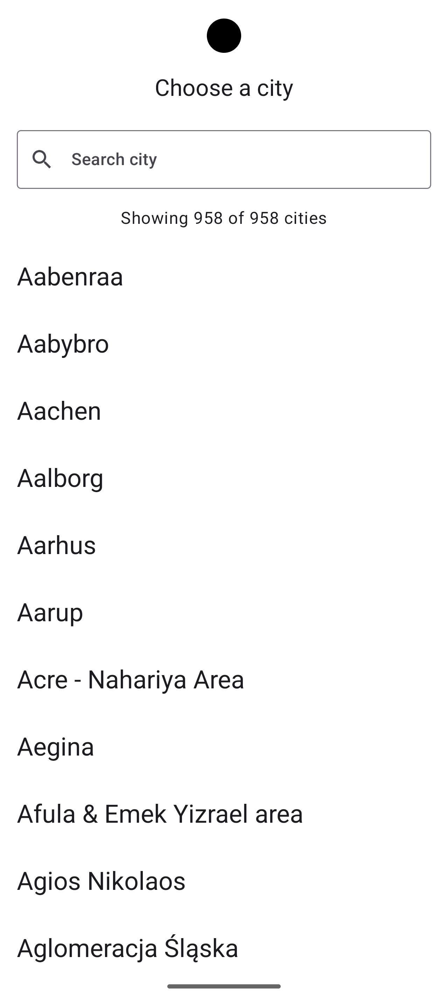
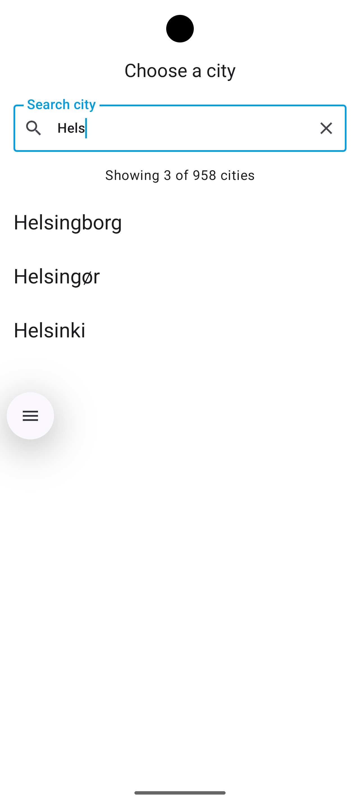
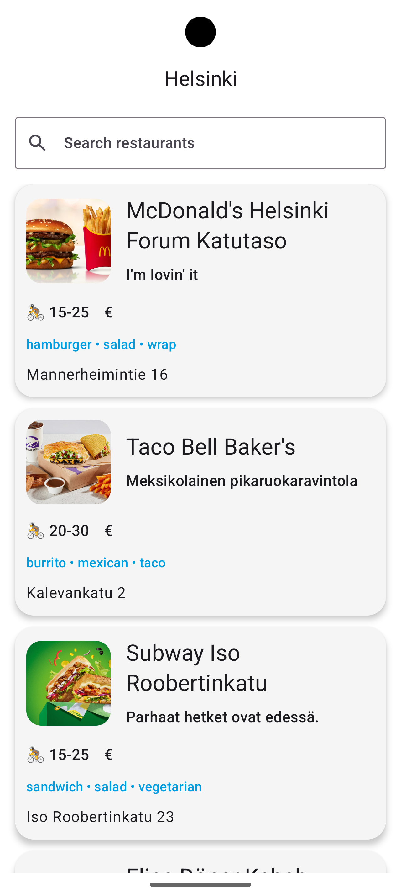
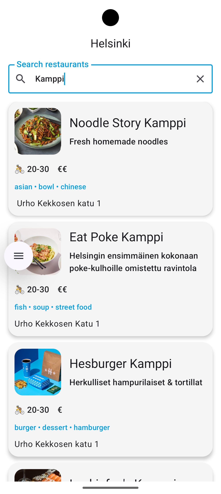

# WoltCompose

> An Android app built with Jetpack Compose and Clean Architecture: pick a city, browse the restaurants delivering there.

| City Selection | City Search | Restaurant List | Restaurant Search |
|:--------------:|:-----------:|:---------------:|:-----------------:|
|  |  |  |  |

---

## Overview

The app loads Wolt's public city list, lets you search it, and then queries the restaurants
available at the selected city's coordinates.

It is deliberately small in feature scope. The interesting part is the structure: how state is
owned and derived, how the layers are separated, and which trade-offs were made where. Those
decisions are documented below, including the ones that are still open.

---

## Architecture

```
Presentation ──▶ Domain ◀── Data
```

The domain layer is pure Kotlin with no Android or networking dependencies. It defines the
models and the repository interfaces. The data layer implements those interfaces and owns
everything about the transport: Retrofit, DTOs, and the mapping to domain models. The
presentation layer depends only on the domain.

```
app
├── data
│   ├── remote        API interfaces, DTOs, mappers
│   └── repository    repository implementations
│
├── domain
│   ├── model         City, Restaurant
│   ├── repository    interfaces the data layer implements
│   └── usecase       entry points for the presentation layer
│
├── presentation
│   ├── cities        screen, ViewModel, UI state
│   ├── restaurants   screen, ViewModel, UI state
│   └── components    shared Compose components
│
├── navigation
└── di                Hilt modules
```

DTOs never leave the data layer. A change to the shape of Wolt's JSON is absorbed by the
mappers and cannot ripple into the UI.

---

## Key decisions

### Navigation carries its own arguments

Destinations are `@Serializable` route types rather than string constants:

```kotlin
@Serializable
data class RestaurantsRoute(
    val cityName: String,
    val latitude: Double,
    val longitude: Double,
)
```

An earlier version passed the selected `City` object between screens by writing it into the
back stack entry's `SavedStateHandle` and reading it back from `previousBackStackEntry`. That
was a real bug, not just an aesthetic one: while a back navigation is in progress the
destination is still composed but `previousBackStackEntry` no longer points where it did, so
the lookup returned null, the null-guard called `popBackStack()`, and it popped the *cities*
screen — leaving an empty back stack and a white screen.

A destination that owns its arguments has no such window. It is also restorable after process
death, which the previous approach was not.

### Screens do not receive a NavController

Composables take callbacks (`onCityClick: (City) -> Unit`) rather than a `NavController`. The
screens have no knowledge of navigation, which keeps them previewable and testable in
isolation, and keeps all routing decisions in one file.

### State is derived, never stored twice

`CitiesViewModel` holds the loaded cities, the query, and the load status as separate sources
of truth, and derives the visible list from them:

```kotlin
val uiState: StateFlow<CitiesUiState> =
    combine(cities, query, isLoading, error) { cities, query, isLoading, error ->
        CitiesUiState(
            cities = cities.filter { it.name.contains(query, ignoreCase = true) },
            totalCityCount = cities.size,
            ...
        )
    }.stateIn(viewModelScope, SharingStarted.WhileSubscribed(5_000), CitiesUiState())
```

Filtering previously ran inside the composable, which meant all 958 cities were filtered *and
re-sorted* on every recomposition. Sorting now happens once, when the data arrives.

### Cancellation is not an error

Both ViewModels rethrow `CancellationException` before their general error handler:

```kotlin
} catch (exception: CancellationException) {
    throw exception
} catch (exception: Exception) {
    // report to the user
}
```

Catching a bare `Exception` in a coroutine also catches cancellation, so leaving a screen
mid-request would surface an error message for what is simply structured concurrency doing
its job.

---

## Testing

20 unit tests, runnable on the JVM with no device:

```bash
./gradlew testDebugUnitTest
```

| Suite | Covers |
|---|---|
| `CitiesViewModelTest` | sorting, loading, case-insensitive filtering, total-count preservation, error handling, cancellation |
| `RestaurantsViewModelTest` | coordinate forwarding, loading, filtering by name and tag, clearing, error handling, cancellation |
| `RestaurantRepositoryImplTest` | selecting the venue section, skipping malformed items, image source, missing section |
| `CityMapperTest` | GeoJSON `[longitude, latitude]` ordering |

Repositories are replaced with hand-written fakes rather than a mocking framework. Each fake
completes through a `CompletableDeferred` that the test controls, so intermediate states such
as "loading" are observable instead of racing to completion.

`MainDispatcherRule` swaps `Dispatchers.Main` for a `StandardTestDispatcher`, which is what
makes `viewModelScope` testable off-device.

---

## Tech stack

Kotlin · Jetpack Compose · Material 3 · Navigation Compose (type-safe routes) · Hilt ·
Retrofit · Kotlin Serialization · Coil · Coroutines & Flow · JUnit4 · Turbine

---

## Known limitations

Tracked deliberately rather than left undocumented:

- **Errors reach the UI as raw exception messages.** They should be mapped to a sealed error
  type in the data layer and resolved to string resources in the UI. As written they are not
  localizable and can leak transport detail.
- **The two search screens use different patterns.** Cities derives its filtered list through
  `combine`; Restaurants still keeps a mutable `allRestaurants` field and writes the filtered
  result back into state. Cities is the pattern worth keeping.
- **`RestaurantsUiState` can represent illegal states** — loading, error, and content are
  independent fields. A sealed interface would make the impossible combinations
  unrepresentable.
- **Restaurant loading is triggered from the UI** via `LaunchedEffect`, rather than the
  ViewModel reading its arguments from `SavedStateHandle`.
- **UI strings are hardcoded** rather than in `strings.xml`, so the app is not localizable.
- **No Compose previews**, and no screenshot or instrumentation tests.
- **No CI, ktlint, or detekt.**
- **Release builds have R8 disabled** and log full HTTP bodies; body logging should be gated
  on `BuildConfig.DEBUG`.
- **Accessibility is unfinished** — the delivery estimate and price range are rendered as an
  emoji and repeated currency symbols, which screen readers cannot interpret.

---

## Running it

```bash
./gradlew installDebug     # build and install on a running emulator or device
./gradlew testDebugUnitTest
```

No API key or configuration is required; the Wolt endpoints used are public.
